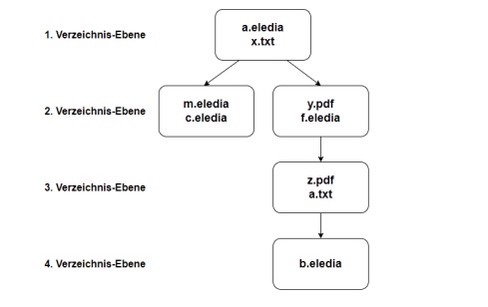

# Coding Challenge

## 1. Problem
Gegeben ist ein Verzeichnis, welches Dateien und Unterverzeichnisse enthalten kann. Unterverzeichnisse können
ebenfalls Dateien und Unterverzeichnisse enthalten.

Einige Dateien innerhalb dieser Verzeichnisstruktur haben die Endung .eledia und sind entweder leer oder
enthalten Text, mit Zeilen im Format <ID>: <Text>

Eine Datei mit der Endung .eledia könnte also folgenden Inhalt haben:

123: Hallo!
4: Morgen soll das Wetter gut werden.
1477: laufen

Jede ID kommt in einer Datei maximal 1x vor. Ist die ID in einer Datei nicht vorhanden, wird diese Datei
übersprungen.


## 2. Aufgabe
Es soll eine Funktion eledia_text(id: int, dir: str) → str geschrieben werden, die als Input eine ID und einen
Verzeichnis-Pfad erhält. Es sollen alle Dateien innerhalb des Verzeichnis-Pfades mit der Endung .eledia gefunden
und der zur Input-ID gehörige Text ausgelesen werden. Anschließend werden die ausgelesenen Texte jeweils mit
einem Leerzeichen dazwischen aneinander gehängt, in der Reihenfolge, in der sie in den Verzeichnisebenen
vorkommen. Sind in einer Verzeichnisebene mehrere .eledia-Dateien vorhanden, ist die Reihenfolge alphabetisch.

Beispiel: 



## 3. Abgabe

Ein Python-Modul eledia.py, dass die Funktion eledia_text enthält. Das Modul kann weitere (Hilfs-) Funktionen,
Variablen etc. enthalten.

## 4.1 Ansatz

1. Rufen Sie zunächst alle Pfade aus der Eingabe ab (dir: str). Diese Funktion kann eine Liste aller Pfade rekursiv vom Ordner zu allen untergeordneten Ordnern/Dateien abrufen, deren Dateipfad mit „.eledia“ endet
 ```python
    def get_all_file_paths(dir: str, ext: str=None) -> list(str):
        """Get all absolute file path where extension path matches with input `ext`
        """
        pass
   ```

 2. Generieren Sie aus der Dateiliste bestellte_Baumdateien aus der Eingabe, die die Struktur grundsätzlich enthalten sollte
```python 
    files_tree = {
        0: ['/dev/a/x.eledia',]
        1: ['/dev/a/b/x.eledia', '/dev/a/c/x.eledia']
    }

    def generate_files_tree(files: list(str)) -> dict
        pass


   ```
3. Aus dem Obigen generiert der „files_tree“ die endgültige Ausgabe


## 4.2 Testdateien

Alle Dateien im Verzeichnis data_files abgelegt

## 4.3 Anleitung zum Ausführen
```
Python main.py

oder

pipenv run python main.py

```

## 4.4 So führen Sie den Test durch

```pytest```

## Anmerkung

-Verwendet os.getcwd() zum einfacheren Testen

## 5. CI/CD (Continues Integration Testing)

- Konfigurierte CI/CD über Github-Aktion für Unit-Pytest bei jedem PR zum Hauptzweig
